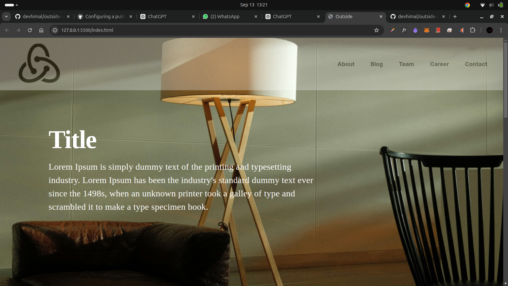
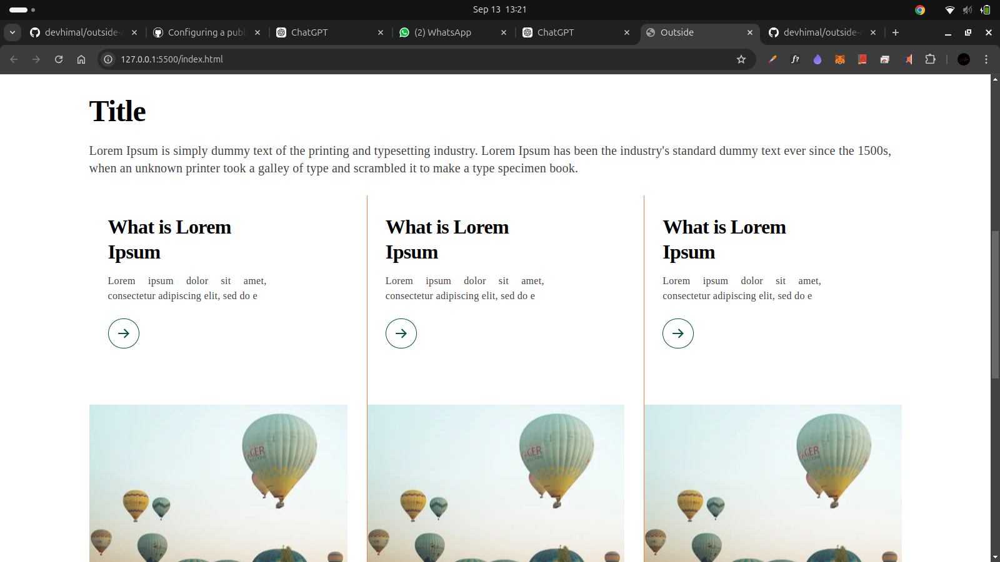
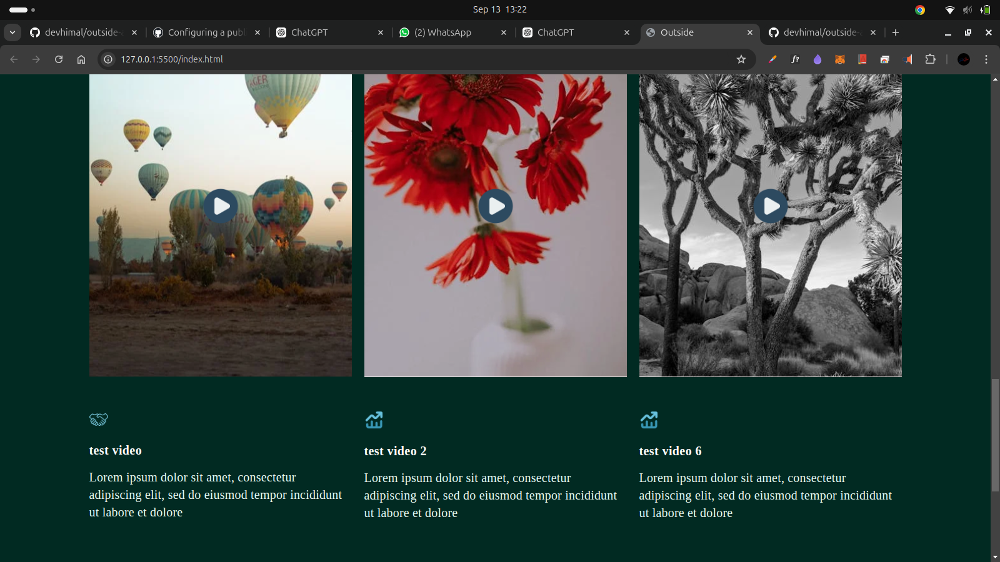
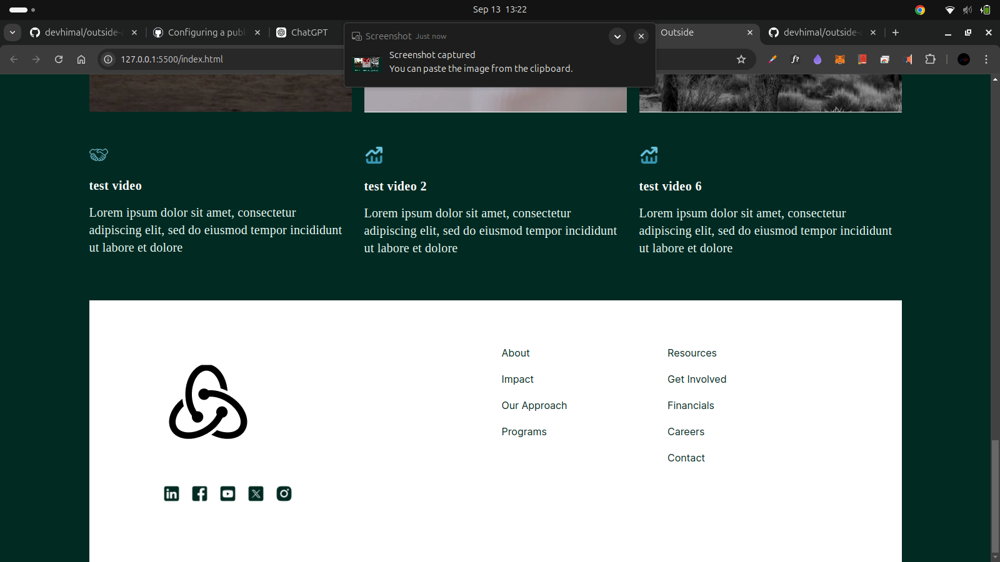

# Assignments Repository
I attempted to deploy the site on GitHub, but due to the custom backend I've built for it, I couldn't get it to work online. I would really appreciate it if you could check the project on your local machine. It's lightweight and should take less than two minutes to set up. Thank you so much in advance for your time and help!, 
Please,follow the steps to run the project on your local  machine

## Technologies Used

- **Backend**: Strapi, JavaScript
- **Frontend**: HTML, CSS

## Getting Started

### Prerequisites

Ensure that you have the following installed:

- [Node.js](https://nodejs.org/)
- [Strapi](https://strapi.io/)

### Installation

1. Clone the repository:

   ```bash
   git clone https://github.com/devhimal/outside-assignment.git
   ```

2. Navigate to the project directory:

   ```bash
   cd outside-assignment and cd backend
   ```

3. Install the necessary dependencies:

   ```bash
   npm install or yarn 
   ```

4. Create .env file and add these files "
      HOST=0.0.0.0
      PORT=1337
      APP_KEYS=JCIRSkrMRAZCf9DyeEFPtg==,uOxcpb7CiANNNDHsyt6dPg==,djJXw2oBIPtekJmQ28ZlWA==,R9YV7Xk/sFdUGstFzqhN3Q==
      API_TOKEN_SALT=mwl3wvvpXCk2Dd+wXDzkgg==
      ADMIN_JWT_SECRET=AMHzJn3nC4+BlYFYoWKNqA==
      TRANSFER_TOKEN_SALT=GqxSfEtIS6yd/QyFrdSoXw==
      # Database
      DATABASE_CLIENT=sqlite
      DATABASE_FILENAME=.tmp/data.db
      JWT_SECRET=ypBhQqQMVtcFVDxACToseA==

### Running the Backend

To start the backend using Strapi, run one of the following commands based on your needs:

- Start Strapi for development:

  ```bash
  npm run develop or yarn develop to run backend server.
  ```


### Running the Frontend

To see the frontend, simply open the `.html` file in your browser. It will display the frontend results.


### Results
## Home Page
# 1. 

# 2.

3. 

4. 

